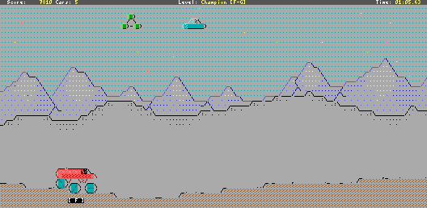

# ascii-patrol
Ascii Patrol is an ASCII game project. It was mainly inspired by "Moon Patrol", my favourite arcade game at the times I was a child.



Currently game can be built for 
- Windows (VC2010)
- Linux & Cygwin (GCC)
- DOS (Watcom) 
- HTML5 browsers (Emscripten)

To use / modify / add graphics asserts located in 'asset' directory you need to use [REXPaint](http://gridsagegames.com/rexpaint)
Copy 'assets' directory to REXPaint's 'images' subdirectory. To apply modifications to the game, in next step you should use
temp_xp program which converts all .xp files located in some directory to assets.cpp and assets.h files being compiled with game. 

[Ascii Patrol Home Page (ascii-patrol.com)](http://ascii-patrol.com)

Accordingly to [raspberrypi.org](https://www.raspberrypi.org/forums/viewtopic.php?f=78&t=188406)
AP can be easily built and runs great on Raspberry PI!

Find me on Twitter: @MrGumix

## Give it a try on any HTML5 browser
- http://ascii-patrol.com/area51/ascii-patrol-html5.html

## Quick install on Linux with *snap*
- ```sudo snap install ascii-patrol```
- https://snapcraft.io/ascii-patrol
  snapped by @popeye

## Need a package? Try these:
Arch Linux:
- https://aur.archlinux.org/packages/ascii-patrol-git/
  by @SlavMetal
- https://aur.archlinux.org/packages/ascii-patrol/
  by Towtow10 (only x64)
  
## Build instructions on Linux (assuming we have git and g++):
```
# clone sources repo
git clone https://github.com/msokalski/ascii-patrol.git

# enter sources directory
cd ascii-patrol

# enable execution of build.sh and run.sh scripts
chmod +x *.sh

# install required packages, (no apt-get -> use pacman)
sudo apt-get install libx11-dev libpulse-dev

# to fix problems with no keyboard input in few gnome terminals we require XI2
sudo apt-get install libxi-dev

# invoke compilation
./build.sh
```
## Running
Ascii Patrol uses curl to communicate with hi-score server (ascii-patrol.com)
So optionally let's install it if needed.
`sudo apt-get install curl`

Finally let's piu-piu !
`./asciipat`
or
`./run.sh`

More on asciipat arguments can be found here: http://ascii-patrol.com/forum/index.php?topic=63

## Problems?
- no sound? -> install / start pulseaudio
- weird colors? -> try another terminal emulator or run from raw console (ctrl-alt-F1 or so)
- poor font look? -> try changing font in your terminal or in case of raw console use setfont
- keyboard doesn't work? -> try another terminal emulator or run from raw console
- no hi-scores table? -> install curl


